# Taller practico sobre Streamlit.

Este taller tiene como objetivo crear varias aplicaciones de [Streamlit](https://streamlit.io/) en donde se pueda interactuar con modelos de inteligencia artificial generativa alojados en [WatsonX](https://www.ibm.com/es-es/watsonx), con una base de datos vectorial de [ChromaDB](https://www.trychroma.com/) y crear un RAG que permita consultar los documentos guardados en la base de datos vectorial.

## Prerrequisitos.
- Tener instalado Python. (La versión recomendada es [**Python 3.11.9**](https://www.python.org/downloads/release/python-3119/). Esto debido a que en las versiones 3.12 y 3.13 se requiere descargar las Visual Studio Build Tools para poder instalar las dependencias de la app)
- (Opcional pero muy recomendable) Tener instalado [Visual Studio Code](https://code.visualstudio.com/).


## Seccion 0: Preparación del entorno e Instalación de Streamlit.

### Paso 0.1: Crear una carpeta para almacenar el código de la aplicación.

Se debe crear una carpeta en el computador. Dentro de esa carpeta es donde se crearan todos los archivos del proyecto. Esta carpeta puede tener cualquier nombre, en este caso se puso el nombre _streamlit-taller_:


### Paso 0.2: Abrir la carpeta con un editor de código (Se recomienda [Visual Studio Code](https://code.visualstudio.com/)).

Tras abrir la carpeta en Visual Studio Code, se deberia ver la siguiente interfaz en la pantalla:


### Paso 0.3: Abrir una consola ubicada en la carpeta del proyecto.

En la consola deberia verse la ruta hasta la carpeta que se creo en el _Paso 0.1_:


### Paso 0.4: Verificar las versiones de Python instaladas en el computador.

Para listar las versiones de Python se puede ejecutar el siguiente comando en la consola.

```console
py --list
```

En la consola se deberia ver una lista de las versiones de Python instaladas. Por ejemplo, esta seria la respuesta en caso de tener instaladas las versiones 3.11 y 3.12:


### Paso 0.5: Crear un entorno virtual de Python.

Un entorno virtual de python es una carpeta donde se tiene una versión de Python y sus paquetes instalados de forma aislada a la instalación principal de Python que se tiene en todo el sistema.

Para crear un entorno virtual, el cual se va a llamar _.venv_ se debe usar el siguiente comando en la consola, donde la X se debe remplazar por la versión de Python con la que se quiere crear el entorno virtual

```console
py -3.X -m venv .venv
```

Por ejemplo, en caso de crear un entorno virtual de Python 3.11 (que es la version recomendada para este taller) se usaria el siguiente comando en la consola:

```console
py -3.11 -m venv .venv
```

Tras ejecutar el comando se debio crear una carpeta llamada _.venv_ en el proyecto, esta carpeta corresponde al entorno virtual de Python que se usará para el proyecto:


### Paso 0.6: Activar el entorno virtual en la consola

En la consola que esta ubicada en la carpeta del proyecto se debe ejecutar alguno de los siguientes comandos para activar el entorno virtual.

En caso de tener una terminal de Powershell utilizar el comando:

```console
.\.venv\Scripts\activate.ps1
```

En caso de tener una terminal de comandos de Windows (CMD) utilziar el comando: 
```console
.\.venv\Scripts\activate.bat
```

Tras ejecutar el comando, en la parte izquierda de la terminal deberia verse el nombre del entorno virtual que fue activado (en este caso _.venv_):


Al activar el entorno virtual en la consola, todos los paquetes que se instalen desde esa consola unicamente serán almacenados en la carpeta del entorno virtual, es decir en la carpeta _.venv_. Esto evita que los paquetes se instalen en todo el sistema, sino que unicamente queden aislados dentro de la carpeta _.venv_ .

### Paso 0.7: Instalar Streamlit en el entorno virtual

Para instalar Streamlit se debe utilizar el siguiente comando en la consola que tiene el entorno virtual activado:

```console
pip install streamlit==1.44.1
```

Tras ejecutar el comando empezarán a descargarse e instalarse todas las librerias necesarias para Streamlit. Este proceso puede tardar unos minutos.

## Sección 1: Crear una aplicación que diga Hola Mundo en Streamlit.

### Paso 1.1: Crear el archivo _hola_mundo.py_

Las aplicaciones de Streamlit se basan en archivos de Python. Es por ello que lo primero que se debe hacer para crear una aplicación de Streamlit es crear un archivo Python. Para este taller se debe crear un archivo llamado _hola_mundo.py_ dentro de la carpeta del proyecto.

Tras crear el archivo _hola_mundo.py_, la carpeta deberia verse de la siguiente manera en Visual Studio Code:


### Paso 1.2: Agregar el mensaje _Hola Mundo_ a la aplicación

Para que la aplicación muestre el mensaje _Hola Mundo_ se deben escribir las siguientes lineas de código en el archivo _hola_mundo.py_

```python
import streamlit as st

st.write("Hola Mundo")
```

La primera linea del código se encarga de importar la libreria streamlit y permite utilizarla bajo el nombre _st_. La segunda linea utiliza el elemento [st.write()](https://link-url-here.org) de Streamlit. Este elemento permite mostrar texto en la pantalla de la aplicación. En este caso el texto que va a mostrar es "Hola Mundo".

Tras esto, se deben guardar los cambios realizado en el archivo _hola_mundo.py_

### Paso 1.3: Ejecutar la aplicación _hola_mundo.py_

Para ejecutar la aplicación se debe utilizar el siguiente comando en la terminal que tiene el entorno virtual activado:

```console
streamlit run hola_mundo.py
```

Al ejecutar el comando debio abrirse una ventana del navegador en la URL http://localhost:8501 

Dentro de esta ventana deberia verse el mensaje 'Hola Mundo':

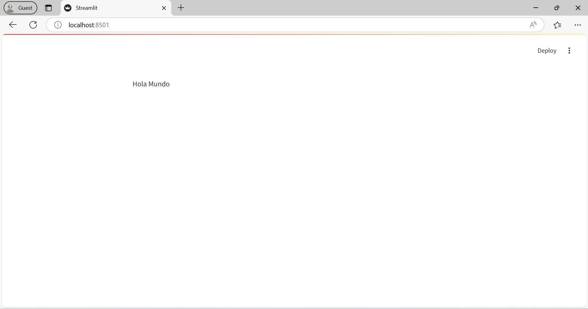

En la parte superior derecha de la pantalla aparece el boton _Deploy_ y un botón de opciones. Estos [botones](https://docs.streamlit.io/develop/concepts/architecture/app-chrome) son creados automaticamente por Streamlit y tienen funcionalidades más avanzadas que no se van a cubrir en este taller.

Con estos simples pasos se ha creado una primera aplicación de Streamlit, la cual muestra en pantalla el mensaje "Hola Mundo".

## Sección 2: Crear una aplicación que muestre un saludo al oprimir un boton.

### Paso 2.1: Agregar un boton a la aplicación.

Para agregar un boton a la aplicación se debe usar el elemento [st.button()](https://docs.streamlit.io/develop/api-reference/widgets/st.button). Este elemento permite dibujar un botón en la pantalla y cada vez que dicho boton sea oprimido la función st.button() retornará el valor True.

Para que en la aplicación se incluya un botón que muestre el mensaje _Hola Mundo_ al ser presionado se debe modificar el código del archivo _hola_mundo.py_ para que quede de la siguiente manera:

```python
import streamlit as st

boton_saludar = st.button("Saludar")

if boton_saludar:
    #Esta parte del código se ejecuta cuando se presiona el boton
    st.write("Hola Mundo")
```

En esta modificación se ha incluido un st.button al código. El primer argumento del st.button es la etiqueta que se quiere que tenga el boton cuando se dibuje en pantalla.

El botón creado se asigna a la variable _boton_saludar_. La variable _boton_saludar_ tomará el valor True cuando el botón sea presionado por el usuario, y cuando esto pase se ejecutará el código dentro de la sentencia _if_, lo cual hará que se escriba el mensaje _Hola Mundo_ en la pantalla.

Una vez se han guardado estos cambios en el archivo _hola_mundo.py_ se puede ir nuevamente a la dirección http://localhost:8501 en el navegador.

Al entrar se deberia seguir viendo unicamente el mensaje _Hola Mundo_, esto ocurre debido a que el navegador aún no ha vuelto a ejecutar la aplicación con los ultimos los cambios realizados en el archivo _hola_mundo.py_.

Para que el navegador vuelva a ejecutar la aplicación y refleje los ultimos cambios del código se tienen dos opciones:

1. Oprimir la tecla R dentro del navegador.

2. Ubicar el cursor sobre el logo _i_ que aparece en la esquina superior derecha de la pantalla y luego dar click al boton _Rerun_ como se muestra en el siguiente video:

https://github.com/user-attachments/assets/3c6c8a82-aa81-4837-b97a-b40cf16dea6d

Tras esto, en el navegador se debe ver la aplicación con los ultimos cambios realizados en el código. Es decir, en la pantalla ahora debe aparecer un botón con la etiqueta _Saludar_. Cuando se oprime el boton se debe mostrar el mensaje _Hola Mundo_:

https://github.com/user-attachments/assets/79f6f154-012d-4daa-966b-42e6cb7f01a1

### Paso 2.2: Agregar un campo de texto para que el usuario pueda escribir su nombre

Ahora se va a modificar el código de la aplicación para que se dibuje un campo de texto donde el usuario pueda escribir su nombre. Luego se hará que cuando se oprima el boton _Saludar_ se muestre un salud con el nombre que ingresó el usuario.

Para esto debemos modificar el código del archivo _hola_mundo.py_ para que se vea de la siguiente manera:

```python
import streamlit as st

nombre_usuario = st.text_input("Escribe tu nombre")

boton_saludar = st.button("Saludar")

if boton_saludar:
    #Esta parte del código se ejecuta cuando se presiona el boton
    st.write(f"Hola {nombre_usuario}")
```

En este caso se ha agregado un elemento de tipo [st.text_input()](https://docs.streamlit.io/develop/api-reference/widgets/st.text_input) al inicio de la aplicación. Este elemento dibuja en la pantalla una caja de texto en la cual el usuario puede escribir. El primer argumento del st.text_input() corresponde al mensaje que se quiere mostrar en pantalla sobre la caja de texto.

La variable _nombre_usuario_ va a almacenar el texto que el usuario escriba en la caja de texto dibujada por el elemento st.text_input. 

Por otra parte, ahora el mensaje que se escribe en pantalla con el elemento st.write va a incluir el _nombre_usuario_ que este escrito en la caja de texto.

Para ver estos cambios reflejados en la aplicación se deben guardar los cambios realizados en el archivo _hola_mundo.py_ y se debe ir al navegador. Se deberia ver la siguiente interfaz tras dar click al boton _Rerun_ que aparece en la parte superior derecha de la pantalla:

https://github.com/user-attachments/assets/29ec2a30-f612-4afc-81c9-de6cd1d7dc32

Con estas lineas de código se pudo crear rápidamente una aplicación que permite mostrar un saludo personalizado al usuario cuando este oprime el boton _Saludar_.

### Paso 2.3: Detener la aplicación

Para detener la aplicación de Streamlit se debe ir a la terminal donde se esta ejecutando la aplicación y oprimir CTRL+C. 

**Es importante que durante este proceso no se cierre la ventana del navegador** donde se estaba viendo la aplicación, ya que si la ventana del navegador se encuentra cerrada, la aplicación no se va a detener con CTRL+C.

A continuación hay un video de ejemplo sobre cómo se debe ver la terminal tras detener la aplicación exitosamente:

https://github.com/user-attachments/assets/a8eb70fa-b605-44ea-8723-e643f17196ef

### Paso 2.4: Conclusión

En esta sección se pudo ver que por medio de los elementos que ofrece Streamlit se pudo crear una aplicación que puede recibir el nombre de un usuario y saludarlo con tan solo 9 lineas de código.

Streamlit acelera mucho el desarrollo de aplicaciones web debido a que permite crear facilmente elementos en la interfaz de la aplicación. Para crear un elemento en la pantalla de la aplicación unicamente es necesario incluir alguno de sus elementos dentro del código Python. 

Cabe resaltar que Streamlit tiene una amplia [biblioteca de elementos](https://docs.streamlit.io/develop/api-reference) que se pueden utilizar para mostrar diversos tipos de textos o graficas. Tambien tiene elementos para recibir distintos tipos de inputs.

La idea de estas dos primeras secciones del taller era familiarizarse con la forma en que se pueden construir aplicaciones simples utilizando el framework Streamlit.

Tambien se buscaba: 
- Mostrar cómo se utilizan algunos elementos de Streamlit y cómo estos se ven reflejados en la interfaz grafica.

- Mostrar cómo se puede ejecutar y detener una aplicación creada con Streamlit.

- Evidenciar que no es necesario detener la aplicación para ver reflejados los cambios realizados en ella, unicamente se deben guardar los cambios y recargar la interfaz grafica para que refleje los ultimos cambios realizados en el código fuente de la aplicación.

En las siguientes secciones del taller se construiran otras aplicaciones un poco más complejas utilizando Streamlit.

## Sección 3: Crear un Mini Prompt Lab en Streamlit

En esta sección del taller se busca crear una versión reducida de la sección Freeform del Prompt Lab de WatsonX que se vio en la sesión teorica.

El Prompt Lab tenia la siguiente interfaz:


Dentro de la aplicación que se va a construir se podrá llamar a un modelo generativo alojado en la plataforma WatsonX utilizando los parametros de inferencia que ingrese el usuario.

### Paso 3.1: Eliminar el archivo _hola_mundo.py_ de la carpeta del proyecto.

### Paso 3.2: Crear un nuevo archivo llamado _mini_prompt_lab.py_ dentro de la carpeta del proyecto.

Tras realizar estos cambios, la carpeta del proyecto deberia verse de la siguiente forma.


Dentro del archivo _mini_prompt_lab.py_ se van a escribir todas las instrucciones para esta nueva aplicación.

### Paso 3.3: Agregar un titulo en la interfaz de la aplicación.

En Streamlit se puede usar el elemento [st.title()](https://docs.streamlit.io/develop/api-reference/text/st.title) para mostrar un texto con formato de titulo dentro de la aplicación.

Para incluir un titulo en el Mini Prompt Lab se debe escribir el siguiente código en el archivo _mini_prompt_lab.py_:

```python
import streamlit as st

st.title("Mini Prompt Lab")
```

Tras escribir el código, se guarda el archivo y se usa el siguiente comando para ejecutar la aplicación.

```console
streamlit run mini_prompt_lab.py
```

Tras ejecutar la aplicación en el navegador deberia verse lo siguiente.


### Paso 3.4: Agregar un menu para que el usuario pueda elegir el modelo.

Para agregar un menu donde se pueda elegir uno de los modelos disponibles en WatsonX, se puede utilizar un elemento [st.selectbox()](https://docs.streamlit.io/develop/api-reference/widgets/st.selectbox). Este elemento crea un menu tipo desplegable en el cual el usuario se puede elegir una opción entre una lista de posibilidades. En este caso, podrá elegir un modelo entre varias opciones.

Para incluir este menu en la aplicación se debe modificar el código escrito en _mini_prompt_lab.py_, el cual debe quedar se la siguiente manera:

```python
import streamlit as st

st.title("Mini Prompt Lab")

modelo_seleccionado = st.selectbox("Elige el modelo que quieres utilizar", ["ibm/granite-3-2-8b-instruct","mistralai/mistral-large", "meta-llama/llama-3-3-70b-instruct", "meta-llama/llama-4-scout-17b-16e-instruct", "meta-llama/llama-4-maverick-17b-128e-instruct-fp8"])
```

La variable _modelo_seleccionado_ va a almacenar el modelo que el usuario elija en el menu que se crea en la interfaz grafica. En este caso en el st.selectbox se incluye una lista que indica cuales son los 5 modelos que el usuario puede elegir (Granite 3.2 8b, Mistral Large, Llama 3.3 70b, Llama 4 Scout, Llama 4 Maverick).

Si se ingresa nuevamente al navegador, ahora debe haber un menu donde el usuario puede elegir el modelo:

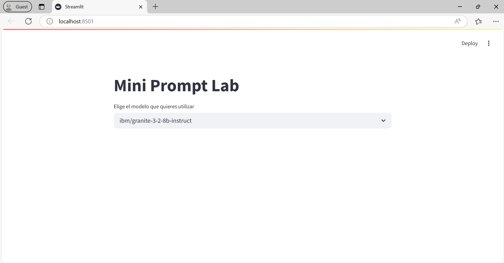

### Paso 3.5: Agregar campos númericos para que el usuario pueda indicar la cantidad mínima y máxima de tokens de respuesta.

Para crear campos de texto en donde el usuario unicamente puede ingresar números desde la interfaz grafica se debe usar el elemento [st.number_input()](https://docs.streamlit.io/develop/api-reference/widgets/st.number_input).

Se van a agregar dos st.number_input() al código de la aplicación, uno para que el usuario pueda indicar la cantidad mínima de tokens de respues que espera y otro para que pueda indicar la cantidad máxima de tokens. 

Para incluir estos elementos se debe modificar el código escrito en el archivo _mini_prompt_lab.py_ para que quede de la siguiente forma:

```python
import streamlit as st

st.title("Mini Prompt Lab")

modelo_seleccionado = st.selectbox("Elige el modelo que quieres utilizar", ["ibm/granite-3-2-8b-instruct","mistralai/mistral-large", "meta-llama/llama-3-3-70b-instruct", "meta-llama/llama-4-scout-17b-16e-instruct", "meta-llama/llama-4-maverick-17b-128e-instruct-fp8"])

min_tokens_seleccionados = st.number_input("Tokens de respuesta mínimos", min_value=0)

max_tokens_seleccionados = st.number_input("Tokens de respuesta máximos", min_value=0, value=200)
```

En este caso se agregaron dos lineas al final, una para el st.input encargado de recibir los tokens minimos que espera el usuario, y otro para recibir los tokens maximos.

Las variables _min_tokens_seleccionados_ y _max_tokens_seleccionados_ almacenarán el número que ingrese el usuario en sus respectivos st.number_input().

Tras estos cambios, la aplicación en el navegador debe verse de la siguiente forma:


### Paso 3.6: Agregar un menu para seleccionar el modo de decodificación

Para que en la aplicación el usuario pueda seleccionar entre utilizar el modo de decodificación "Greedy" o "Sampling" se puede utilizar un menu del tipo [st.radio()](https://docs.streamlit.io/develop/api-reference/widgets/st.radio). Este menu permite al usuario elegir una entre varias opciones.

El código en el archivo _mini_prompt_lab.py_ se debe modificar de la siguiente manera para incluir un menu que permita seleccionar el modo de decodificación:

```python
import streamlit as st

st.title("Mini Prompt Lab")

modelo_seleccionado = st.selectbox("Elige el modelo que quieres utilizar", ["ibm/granite-3-2-8b-instruct","mistralai/mistral-large", "meta-llama/llama-3-3-70b-instruct", "meta-llama/llama-4-scout-17b-16e-instruct", "meta-llama/llama-4-maverick-17b-128e-instruct-fp8"])

min_tokens_seleccionados = st.number_input("Tokens de respuesta mínimos", min_value=0)

max_tokens_seleccionados = st.number_input("Tokens de respuesta máximos", min_value=0, value=200)

modo_seleccionado = st.radio("Elige un modo de decodificación", ["Greedy", "Sampling"])
```

Tras este cambio, la aplicación en el navegador debe verse de la siguiente forma:


### Paso 3.7: Agregar los parametros para el modo Sampling.

Cuando se selecciona el modo Sampling en el Prompt Lab se permite al usuario configurar parametros adicionales cómo lo son la temperatura, el top p, el top k y la random seed para la generación del texto:


En la aplicación se van a agregar elementos del tipo [st.slider()](https://docs.streamlit.io/develop/api-reference/widgets/st.slider) para que el usuario pueda seleccionar la temperatura, top p y top k cuando tenga seleccionado el modo "Sampling". Además se va a agregar un st.number_input() para que el usuario pueda indicar la random seed a utilizar en caso de que quiera utilizar alguna.

Para incluir esta lógica en la aplicación, se debe modificar el archivo _mini_prompt_lab.py_ para que quede de la siguiente forma:

```python
import streamlit as st

st.title("Mini Prompt Lab")

modelo_seleccionado = st.selectbox("Elige el modelo que quieres utilizar", ["ibm/granite-3-2-8b-instruct","mistralai/mistral-large", "meta-llama/llama-3-3-70b-instruct", "meta-llama/llama-4-scout-17b-16e-instruct", "meta-llama/llama-4-maverick-17b-128e-instruct-fp8"])

min_tokens_seleccionados = st.number_input("Tokens de respuesta mínimos", min_value=0)

max_tokens_seleccionados = st.number_input("Tokens de respuesta máximos", min_value=0, value=200)

modo_seleccionado = st.radio("Elige un modo de decodificación", ["Greedy", "Sampling"])

if modo_seleccionado == "Sampling":
    temperature_seleccionada = st.slider("Temperature", min_value=0.00, max_value=2.00, value=0.7, step=0.01)
    top_p_seleccionado = st.slider("Top P", min_value=0.01, max_value=1.00, value=1.00, step=0.01)
    top_n_seleccionado = st.slider("Top K", min_value=1, max_value=100, value=50, step=1)
    random_seed_seleccionada = st.number_input("Random seed", min_value=1, value=None)
```

Las variables asignadas a los elementos de tipo st.slider() almacenan el valor que el usuario haya seleccionado utilizando el slider desde la interfaz.

Por otra parte, el elemento st.number_input utilizado para que el usuario pueda ingresar la random seed tendrá por defecto el valor None, esto por si el usuario no quiere usar una random seed especifica.

Tras guardar los cambios realizados, en el navegador al seleccionar la opción "Sampling" deberian salir los siguientes elementos:

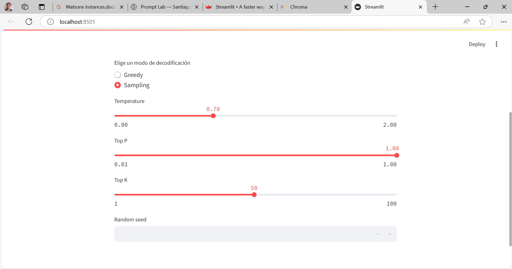

### Paso 3.8: Agregar un slider para el parametro Repetition Penalty

Al final del código se va a agregar otro st.slider() el cual se va a encargar de dibujar otro slider donde el usuario pueda seleccionar el valor del parametro repetition penalty. Este slider va a aparecer tanto cuando se selecciona el modo de deodiciación "Greedy" cómo cuando se selecciona el modo "Sampling".

Para ello se debe modificar el código de _mini_prompt_lab.py_ de la siguiente forma:

```python
import streamlit as st

st.title("Mini Prompt Lab")

modelo_seleccionado = st.selectbox("Elige el modelo que quieres utilizar", ["ibm/granite-3-2-8b-instruct","mistralai/mistral-large", "meta-llama/llama-3-3-70b-instruct", "meta-llama/llama-4-scout-17b-16e-instruct", "meta-llama/llama-4-maverick-17b-128e-instruct-fp8"])

min_tokens_seleccionados = st.number_input("Tokens de respuesta mínimos", min_value=0)

max_tokens_seleccionados = st.number_input("Tokens de respuesta máximos", min_value=0, value=200)

modo_seleccionado = st.radio("Elige un modo de decodificación", ["Greedy", "Sampling"])

if modo_seleccionado == "Sampling":
    temperature_seleccionada = st.slider("Temperature", min_value=0.00, max_value=2.00, value=0.7, step=0.01)
    top_p_seleccionado = st.slider("Top P", min_value=0.01, max_value=1.00, value=1.00, step=0.01)
    top_n_seleccionado = st.slider("Top K", min_value=1, max_value=100, value=50, step=1)
    random_seed_seleccionada = st.number_input("Random seed", min_value=1, value=None)

repetition_penalty_seleccionada = st.slider("Repetition Penalty", min_value=1.00, max_value=2.00, value=1.00, step=0.01)
```

Tras agregar este elemento, en la parte de abajo de la aplicación deberia salir un slider para seleccionar el valor de repetition penalty:

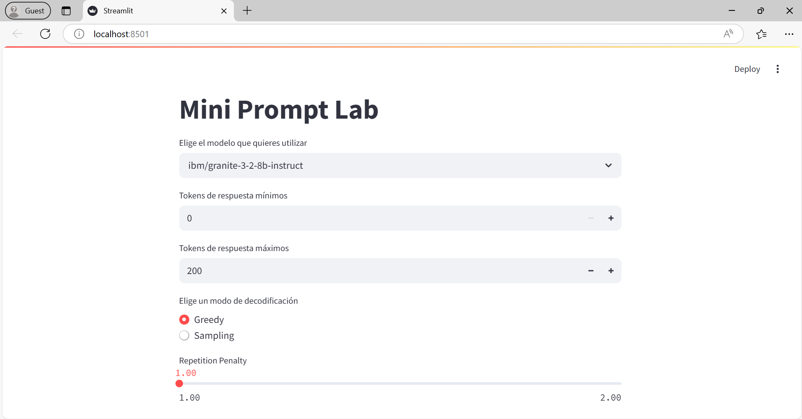

### Paso 3.9: Agregar un espacio para el prompt y un boton para llamar al modelo.

Para agregar un espacio donde el usuario pueda escribir el prompt se va a utilizar un elemento del tipo [st.text_area()](https://docs.streamlit.io/develop/api-reference/widgets/st.text_area). Este elemento se encarga de dibujar una caja de texto grande en la pantalla.

Además de ello, se va a agregar al final del código un botón con el cual el usuario va a poder llamar al modelo con el prompt y los parametros seleccionados.

Para esto se debe modificar el código del archivo _mini_prompt_lab.py_ para que quede de la siguiente forma:

```python
import streamlit as st

st.title("Mini Prompt Lab")

modelo_seleccionado = st.selectbox("Elige el modelo que quieres utilizar", ["ibm/granite-3-2-8b-instruct","mistralai/mistral-large", "meta-llama/llama-3-3-70b-instruct", "meta-llama/llama-4-scout-17b-16e-instruct", "meta-llama/llama-4-maverick-17b-128e-instruct-fp8"])

min_tokens_seleccionados = st.number_input("Tokens de respuesta mínimos", min_value=0)

max_tokens_seleccionados = st.number_input("Tokens de respuesta máximos", min_value=0, value=200)

modo_seleccionado = st.radio("Elige un modo de decodificación", ["Greedy", "Sampling"])

if modo_seleccionado == "Sampling":
    temperature_seleccionada = st.slider("Temperature", min_value=0.00, max_value=2.00, value=0.7, step=0.01)
    top_p_seleccionado = st.slider("Top P", min_value=0.01, max_value=1.00, value=1.00, step=0.01)
    top_n_seleccionado = st.slider("Top K", min_value=1, max_value=100, value=50, step=1)
    random_seed_seleccionada = st.number_input("Random seed", min_value=1, value=None)

repetition_penalty_seleccionada = st.slider("Repetition Penalty", min_value=1.00, max_value=2.00, value=1.00, step=0.01)

prompt_del_usuario = st.text_area("Prompt", placeholder="Escribe aquí tu prompt")

boton_llamar_modelo = st.button("Llamar al modelo")
```

La variable _prompt_del_usuario_ va a almacenar el texto que el usuario escriba en el area de texto que se muestra en la aplicación.

Tras estos cambios, en la parte de abajo de la aplicación deberian verse los siguientes elementos:

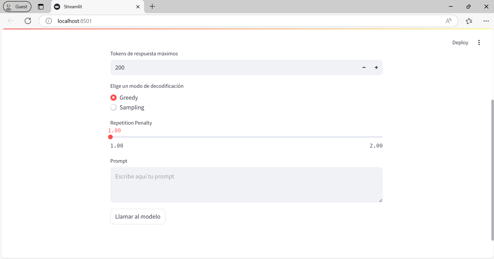

Hasta el momento se ha adelantado la mayor parte de la interfaz del Mini Prompt Lab. A continuación se va a escribir el código que va permitir llamar los modelos alojados en WatsonX.

### Paso 3.10: Instalar las librerias necesarias para llamar a WatsonX

Para instalar las librerias primero se debe detener la aplicación de Streamlit utilizando CTRL+C en la terminal.

Tras esto, en la misma terminal se debe ejecutar el comando:

```console
pip install ibm-watsonx-ai==1.3.3
```

Luego se debe ejecutar este otro comando:

```console
pip install ibm-cloud-sdk-core==3.23.0
```

Las librerias [ibm-watsonx-ai](https://ibm.github.io/watsonx-ai-python-sdk/) y [ibm-cloud-sdk-core](https://pypi.org/project/ibm-cloud-sdk-core/) permiten conectarse a los diversos servicios ofrecidos por WatsonX.

### Paso 3.11: Instalar una liberia para leer variables de entorno

Normalmente las credenciales para acceder a los modelos de IA Generativa se escriben en un archivo aparte llamado _.env_ y no directamente en el código de la aplicación. Esto para evitar que mis credenciales sean expuestas publicamente cuando comparta el código de la aplicación y para que queden en un archivo independiente que sea facild e editar en caso de que mis credenciales hayan cambiado.

Para que la aplicación pueda leer las variables almacenadas en el archivo _.env_ se debe instalar la libreria [python-dotenv](https://pypi.org/project/python-dotenv/) con el comando:

```console
pip install python-dotenv==1.1.0
```

### Paso 3.12: Crear el archivo _.env_ para escribir las credenciales

En la carpeta del proyecto se debe crear un archivo llamado _.env_

Se recomienda crear este archivo desde Visual Studio Code para garantizar que su nombre sea unicamente _.env_ . Es posible que si se crea desde el explorador de archivos de windows, el archivo quede con otros nombres que no son adecuados. Es importante que el archivo unicamente se llame _.env_ .

Tras crear el archivo, la carpeta del proyecto deberia verse de la siguiente manera en Visual Studio Code:


Dentro del archivo _.env_ se deben escribir las siguientes variables:

```bat
WATSONX_API_KEY = 
IBM_CLOUD_URL = https://us-south.ml.cloud.ibm.com
WATSONX_PROJECT_ID = 
```

A las variables WATSONX_API_KEY y WATSONX_PROJECT_ID se les debe asignar el Api Key y Project Id que le den los tutores el dia del taller.

Una vez asignados esos valores, el archivo _.env_ deberia verse de forma similar al siguiente, solo que los valores de las variables WATSONX_API_KEY y WATSONX_PROJECT_ID deben corresponder a la que le dieron el dia del taller:

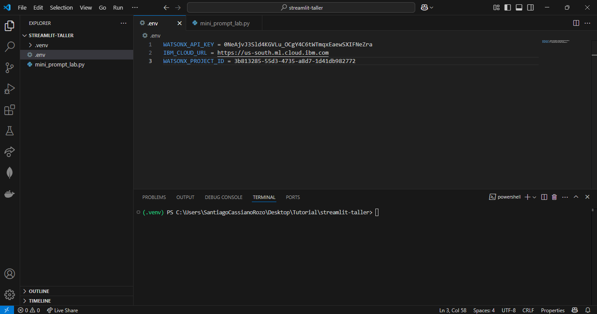

Tras esto se puede guardar y cerrar el archivo _.env_.

### Paso 3.13: Crear un archivo con las funciones necesarias para llamar a WatsonX

Dentro de la carpeta del proyecto se debe crear una carpeta llamada _utils_ y dentro de esta carpeta se debe crear un archivo llamado _watsonx_functions.py_. Tras hacer esto, en Visual Studio Code se deberia ver el proyecto de la siguiente manera:


Dentro de este archivo se debe copiar el siguiente código, el cual trae dos funciones hechas para llamar los modelos alojados en WatsonX:

```python
from ibm_watsonx_ai.foundation_models import ModelInference
from ibm_watsonx_ai.metanames import GenTextParamsMetaNames as GenParams
from dotenv import load_dotenv
import os
from ibm_cloud_sdk_core.authenticators import IAMAuthenticator
import requests
import base64

#Cargar las variables de entorno escritas en el archivo .env
load_dotenv()

#Se asginan las variables de entorno a variables en el script
watsonx_api_key = os.environ["WATSONX_API_KEY"]
ibm_cloud_url = os.environ["IBM_CLOUD_URL"]
watsonx_project_id = os.environ["WATSONX_PROJECT_ID"]

#Se crea el diccionario creds, el cual es utilizado en el llamado a WatsonX
creds = {"url": ibm_cloud_url, "apikey": watsonx_api_key}

#Funcion para llamar modelos de texto alojados en WatsonX
def call_watsonx_text_model(
    prompt: str,
    id_modelo: str,
    min_tokens: int,
    max_tokens: int,
    modo: str,
    repetition_penalty: float,
    temperatura: float = 0.7,
    top_p: float = 1.00,
    top_n: int = 50,
    random_seed: int = None):

    if modo == "Greedy":
        #Si el modo es greedy, le pasamos los siguientes parametros al modelo
        parametros = {
            GenParams.DECODING_METHOD: "greedy",
            GenParams.MIN_NEW_TOKENS: min_tokens,
            GenParams.MAX_NEW_TOKENS: max_tokens,
            GenParams.REPETITION_PENALTY: repetition_penalty,
        }

    elif modo == "Sampling":
        #Si el modo es sampling, se le pasan los siguientes parametros al modelo
        parametros = {
            GenParams.DECODING_METHOD: "sample",
            GenParams.MIN_NEW_TOKENS: min_tokens,
            GenParams.MAX_NEW_TOKENS: max_tokens,
            GenParams.TEMPERATURE: temperatura,
            GenParams.TOP_P: top_p,
            GenParams.TOP_K: top_n,
            GenParams.REPETITION_PENALTY: repetition_penalty
        }
        #Si el usuario especifico una random seed (es decir el valor de random_seed es None), 
        # esta random seed se incluye en el diccionario de parametros
        if random_seed is not None:
            parametros[GenParams.RANDOM_SEED] = random_seed

    #Se crea un objeto ModelInference con todos los datos proporcionados
    watsonx_model = ModelInference(model_id=id_modelo, params=parametros, credentials=creds, project_id=watsonx_project_id)

    #Utilizando el metodo generate_text del objeto ModelInference se hace un 
    #llamado al modelo con el prompt que se pasa como argumento. El modelo se encuentra alojado en IBM Cloud.
    #La función retorna el texto generado por el modelo.
    watsonx_response = watsonx_model.generate_text(prompt)
    return watsonx_response

#Funcion para llamar modelos multimodales de vision alojados en WatsonX
def call_watsonx_vision_model(
    prompt: str,
    imagen,
    id_modelo: str,
    max_tokens: int):

    #Leer los bytes de la imagen
    image_bytes = imagen.getvalue()

    #Codificar la imagen en base 64
    image_base64_encoded_bytes = base64.b64encode(image_bytes)

    #Decodificar de base 64 a un string con codificacion utf8
    image_utf8_string = image_base64_encoded_bytes.decode('utf-8')

    #Crear un autenticador para llamar a WatsonX
    authenticator = IAMAuthenticator(watsonx_api_key)

    #Generar un bearer token
    bearer_token = authenticator.token_manager.get_token()

    #Definir la url a la que se va a hacer la consulta:
    url = "https://us-south.ml.cloud.ibm.com/ml/v1/text/chat?version=2023-05-29"

    #Definir el body de la peticion, en esta se incluye el prompt que vamos a hacer y la imagen en los mensajes
    body = {
	"messages": [
        {"role":"user",
         "content":[
            {"type":"text",
              "text":prompt
            },
            {"type":"image_url",
             "image_url":{"url":f"data:{imagen.type};base64,{image_utf8_string}"}
            }
        ]}
    ],
	"project_id": watsonx_project_id,
	"model_id": id_modelo,
	"max_tokens": max_tokens,
    "temperature": 0,
    "top_p": 1,
    "frecuency_penalty":0,
    "presence_penalty":0
    }

    #Headers de la peticion
    headers = {
        "Accept": "application/json",
        "Content-Type": "application/json",
        "Authorization": "Bearer "+ bearer_token
    }

    #Se realiza la peticion al modelo
    response = requests.post(url, headers=headers, json=body)

    #Si la respuesta no es exitosa generar un error
    if response.status_code != 200:
        raise Exception("Non-200 response: "+ str(response.text))
    
    #Si la respuesta fue exitosa entonces leer el json de la respuesta y retornar el texto generado por el modelo
    response_json = response.json()
    return response_json['choices'][0]['message']['content']
```

En el código hay dos funciones:
- La funcion _call_watsonx_text_model()_ permite llamar a los modelos capaces de procesar texto. Esta función recibe el prompt que se quiere realizar y todos los parametros con los que se quiere llamar el modelo alojado en la plataforma WatsonX. Dependiendo de si seleccionamos el modo “Greedy”, o “Sampling”, se envian algunos parametros o no. La función retorna unicamente el texto generado por el modelo.

- La funcion _call_watsonx_vision_model()_ permite llamar a los modelos multimodales capaces de recibir imagenes y texto para generar una respuesta. Esta función recibe el prompt que se quiere realizar, la imagen que se quiere adjuntar y algunos parametros adicionales con los que llamar el modelo alojado en la plataforma WatsonX (El modelo que quiero usar y la cantidad máxima de tokens de respuesta). La función retorna unicamente el texto generado por el modelo.

Una vez se ha escrito el código en el archivo _watsonx_functions.py_ se puede guardar y cerrar el archivo.

### Paso 3.14: Importar la funcion _call_watsonx_text_model_ dentro del archivo _mini_prompt_lab.py_

Para importar la función se debe incluir esta sentencia al inicio del código escrito en el archivo _mini_prompt_lab_.py:

```python
from utils.watsonx_functions import call_watsonx_text_model
```

### Paso 3.15: Incluir la lógica para llamar a un modelo en _mini_prompt_lab.py_

Al final del archivo _mini_prompt_lab.py_ se debe incluir la lógica para que cuando se oprima el botón que dice "Llamar al modelo", se llamé la función _call_watsonx_text_model()_ con los parametros que el usuario indicó en la aplicación.

Para esto se debe modificar el código del archivo _mini_prompt_lab.py_ el cual debe quedar se la siguiente forma:

```python
import streamlit as st
from utils.watsonx_functions import call_watsonx_text_model

st.title("Mini Prompt Lab")

modelo_seleccionado = st.selectbox("Elige el modelo que quieres utilizar", ["ibm/granite-3-2-8b-instruct","mistralai/mistral-large", "meta-llama/llama-3-3-70b-instruct", "meta-llama/llama-4-scout-17b-16e-instruct", "meta-llama/llama-4-maverick-17b-128e-instruct-fp8"])

min_tokens_seleccionados = st.number_input("Tokens de respuesta mínimos", min_value=0)

max_tokens_seleccionados = st.number_input("Tokens de respuesta máximos", min_value=0, value=200)

modo_seleccionado = st.radio("Elige un modo de decodificación", ["Greedy", "Sampling"])

if modo_seleccionado == "Sampling":
    temperature_seleccionada = st.slider("Temperature", min_value=0.00, max_value=2.00, value=0.7, step=0.01)
    top_p_seleccionado = st.slider("Top P", min_value=0.01, max_value=1.00, value=1.00, step=0.01)
    top_n_seleccionado = st.slider("Top K", min_value=1, max_value=100, value=50, step=1)
    random_seed_seleccionada = st.number_input("Random seed", min_value=1, value=None)

repetition_penalty_seleccionada = st.slider("Repetition Penalty", min_value=1.00, max_value=2.00, value=1.00, step=0.01)

prompt_del_usuario = st.text_area("Prompt", placeholder="Escribe aquí tu prompt")

boton_llamar_modelo = st.button("Llamar al modelo")

if boton_llamar_modelo:
    if modo_seleccionado == "Greedy":
        respuesta_generada = call_watsonx_text_model(
            prompt=prompt_del_usuario,
            id_modelo=modelo_seleccionado,
            min_tokens= min_tokens_seleccionados,
            max_tokens = max_tokens_seleccionados,
            modo = modo_seleccionado,
            repetition_penalty=repetition_penalty_seleccionada
        )

    elif modo_seleccionado == "Sampling":
        respuesta_generada = call_watsonx_text_model(
            prompt=prompt_del_usuario,
            id_modelo=modelo_seleccionado,
            min_tokens= min_tokens_seleccionados,
            max_tokens = max_tokens_seleccionados,
            modo = modo_seleccionado,
            repetition_penalty=repetition_penalty_seleccionada,
            temperatura=temperature_seleccionada,
            top_p=top_p_seleccionado,
            top_n=top_n_seleccionado,
            random_seed=random_seed_seleccionada
        )
    
    with st.expander("Respuesta Generada ", expanded=True):
        st.write(respuesta_generada)
```

La lógica adicional agregada al final del código permite que cuando se oprima el boton, se verifique si el usuario seleccionó el modo Greedy o Sampling y a partir de ello se llama a la función _call_watsonx_text_model()_ con los paremetros necesarios para modo de decodificación. 

Una vez se genera la respuesta, esta se muestra dentro de un contenedor de tipo [st.expander()](https://docs.streamlit.io/develop/api-reference/layout/st.expander). Los contenedores en Streamlit permiten crear cajas dentro de la pantalla en donde se puden dibujar otros elementos dentro de ellas.

En las instrucciones que estan al final del código las cuales dicen:

```python
    with st.expander("Respuesta Generada ", expanded=True):
        st.write(respuesta_generada)
```

Permiten crear un contenedor de tipo st.expander, y dentro de este contenedor se va a escribir la respuesta generada por el modelo. 

Cuando se escribe una sentencia _with_ en Streamlit, lo que se hace es que todo aquello que este dentro del bloque with se dibuje dentro del contendor, el cual en este caso es un st.expander.

Para tener una mayor claridad de cómo se ve el contendor st.expander, se va a ejecutar la aplicación y se vera su funcionamiento.

### Paso 3.16: Ejecutar el Mini Prompt Lab

Para ejecutar la aplicación, en la terminal se ejecuta el comando:

```console
streamlit run mini_prompt_lab.py
```

Una vez se ejecuta, desde el navegador se puede utilizar la aplicación para realizar un prompt a un LLM:

https://github.com/user-attachments/assets/4df52147-3e09-4b9e-96fe-d15521c94292

Aquí se puede observar con mayor claridad que cuando el modelo responde se dibuja un contenedor (El cual corresponse al st.expander()) y dentro de ese contenedor se escribe la respuesta generada.

El contendor st.expander se caracteriza por poder expanderse o contraerse cuando se da click sobre el. En Streamlit hay otro tipo de contenedores, los cuales se pueden ver [aqui.](https://docs.streamlit.io/develop/api-reference/layout)

### Paso 3.17: Conclusion

Se ha creado un Mini Prompt Lab con el cual se puede experimentar con varios modelos generativos y sus parametros de inferencia. Dentro de esta aplicación se pudo utilizar más elementos de Streamlit y se realizo la conexión con WatsonX.

En la siguiente sección del taller se va a construir un Mini Prompt Lab pero que utilice modelos multimodales capaced de recibir imagenes y texto.

## Sección 4: Crear un Mini Prompt Lab para Modelos Multimodales

En esta parte del taller se va a crear una nueva aplicación que permite realizar preguntas a un modelo multimodal que recibe un prompt y una imagen que el usuario suba o tome con su cámara.

### Paso 4.1: Detener la aplicación _mini_prompt_lab.py_ en caso de que se este ejecutando

### Paso 4.2: Crear un nuevo archivo llamado _multimodal_prompt_lab.py_ en la carpeta del proyecto

La carpeta del proyecto en este momento debe verse de la siguiente forma:

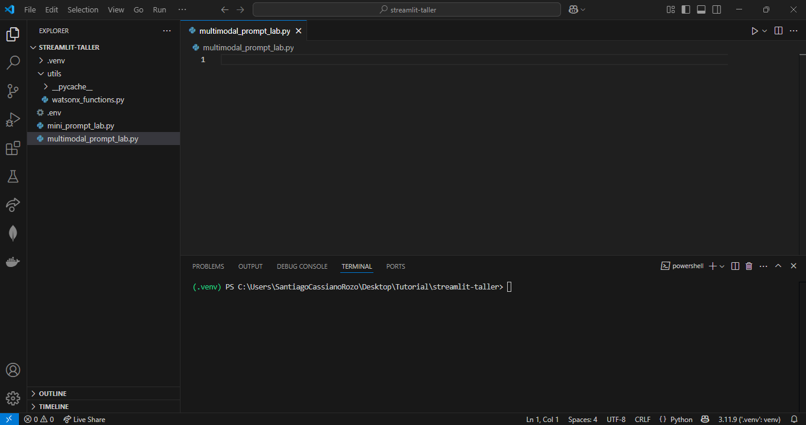

### Paso 4.3: Crear la primera parte de la interfaz de la aplicación.

Dentro del archivo multimodal_prompt_lab.py se deben escribir las siguientes lineas de código:

```python
import streamlit as st 
from utils.watsonx_functions import call_watsonx_vision_model

st.title("Mini Prompt Lab Multimodal")

modelo_seleccionado = st.selectbox("Elige el modelo que quieres utilizar", ["meta-llama/llama-4-scout-17b-16e-instruct", "meta-llama/llama-4-maverick-17b-128e-instruct-fp8", "meta-llama/llama-3-2-90b-vision-instruct","meta-llama/llama-3-2-11b-vision-instruct", "ibm/granite-vision-3-2-2b"]) 

max_tokens_seleccionados = st.number_input("Tokens de respuesta máximos", min_value=0, value=900)

modo_subir_imagen = st.radio("Selecciona una opcion", ["Subir imagen desde mi dispositivo", "Tomar una foto con la cámara"])
```

Estas lineas son similares a las usadas al inicio del Mini Prompt Lab. A partir de estas lineas se crea un titulo para la aplicación, un menu para seleccionar el modelo multimodal y un espacio para escribir la maxima cantidad de tokens.

En la ultima linea se crea un menu en donde el usuario puede decidir si quiere subir una imagen o quiere tomar una foto con su cámara para usarla en la aplicación.

En este momento se puede ejecutar la aplicación con el comando:

```python
streamlit run multimodal_prompt_lab.py
```

Tras ejecutar la aplicación, en el navegador deberian verse los siguientes elementos:

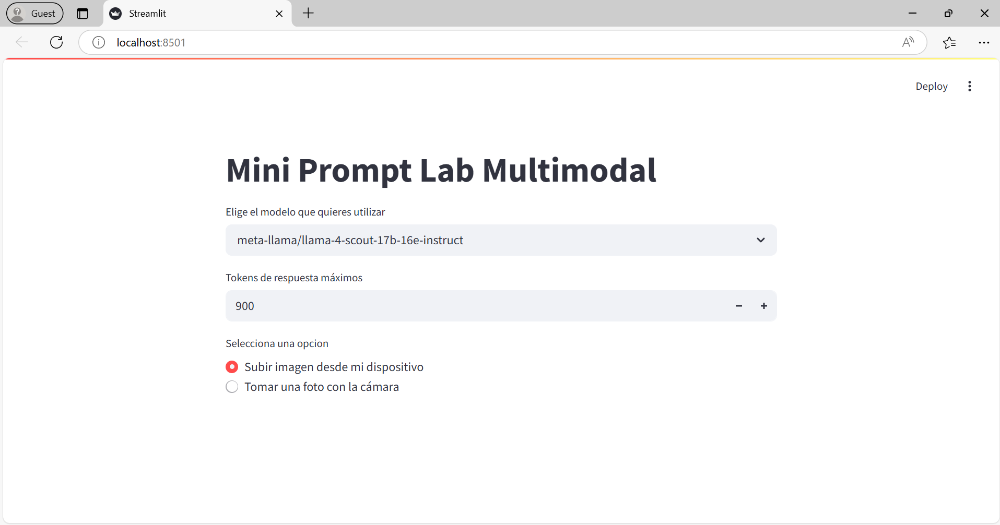

### Paso 4.4: Agregar la lógica para cuando el usuario quiere Subir una Imagen.

Para que el usuario pueda subir una imagen podemos utilizar el elemento [st.file_uploader()](https://docs.streamlit.io/develop/api-reference/widgets/st.file_uploader). Este elemento crea una caja donde el usuario puede subir archivos. Por otra parte, una vez el usuario ha subido una imagen, podemos mostrarla en pantalla utilizando el elemento [st.image()](https://docs.streamlit.io/develop/api-reference/media/st.image).


Para que el usuario pueda subir una imagen y luego se pueda visualiziar la imagen subida dentro de un contendor st.expander() se debe modificar el código del archivo _multimodal_prompt_lab.py_ de la siguiente manera:

```python
import streamlit as st 
from utils.watsonx_functions import call_watsonx_vision_model

st.title("Mini Prompt Lab Multimodal")

modelo_seleccionado = st.selectbox("Elige el modelo que quieres utilizar", ["meta-llama/llama-4-scout-17b-16e-instruct", "meta-llama/llama-4-maverick-17b-128e-instruct-fp8", "meta-llama/llama-3-2-90b-vision-instruct","meta-llama/llama-3-2-11b-vision-instruct", "ibm/granite-vision-3-2-2b"]) 

max_tokens_seleccionados = st.number_input("Tokens de respuesta máximos", min_value=0, value=900)

modo_subir_imagen = st.radio("Selecciona una opcion", ["Subir imagen desde mi dispositivo", "Tomar una foto con la cámara"])

if modo_subir_imagen == "Subir imagen desde mi dispositivo":
    imagen_subida = st.file_uploader("Sube una imagen", type=["jpg","jpeg","png"])
    if imagen_subida is not None:
        with st.expander("Visualización de la imagen subida", expanded=True):
            st.image(imagen_subida)
```

Si se guardan los cambios y se va al navegador, en la parte de abajo de la pantalla el usuario tiene un espacio donde puede subir la imagen y cuando sube la imagen esta puede verse en la aplicación:

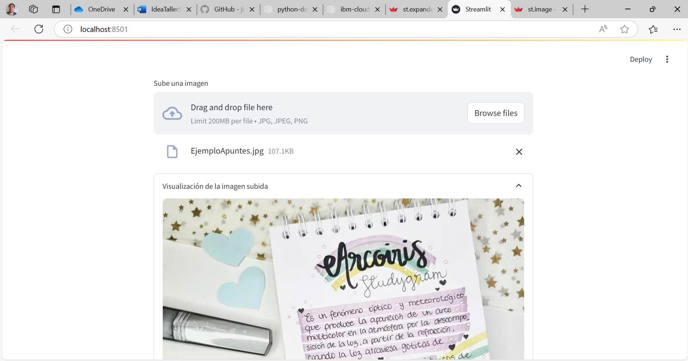

### Paso 4.5 Agregar la lógica para cuando el usuario queire Tomar una foto con su cámara.

Si el usuario quiere tomar la foto con su cámara entonces se puede utilizar el elemento [st.camera_input()](https://docs.streamlit.io/develop/api-reference/widgets/st.camera_input). Esta instrucción dibuja en la interfaz un elemento que permite capturar imagenes con la cámara del dispositivo. 

Para que este elemento se muestre cuando el usuario quiere tomar una foto con su dispositivo se debe modificar el código del archivo _multimodal_prompt_lab.py_ de la siguiente forma:

```python
import streamlit as st 
from utils.watsonx_functions import call_watsonx_vision_model

st.title("Mini Prompt Lab Multimodal")

modelo_seleccionado = st.selectbox("Elige el modelo que quieres utilizar", ["meta-llama/llama-4-scout-17b-16e-instruct", "meta-llama/llama-4-maverick-17b-128e-instruct-fp8", "meta-llama/llama-3-2-90b-vision-instruct","meta-llama/llama-3-2-11b-vision-instruct", "ibm/granite-vision-3-2-2b"]) 

max_tokens_seleccionados = st.number_input("Tokens de respuesta máximos", min_value=0, value=900)

modo_subir_imagen = st.radio("Selecciona una opcion", ["Subir imagen desde mi dispositivo", "Tomar una foto con la cámara"])

if modo_subir_imagen == "Subir imagen desde mi dispositivo":
    imagen_subida = st.file_uploader("Sube una imagen", type=["jpg","jpeg","png"])
    if imagen_subida is not None:
        with st.expander("Visualización de la imagen subida", expanded=True):
            st.image(imagen_subida)

elif modo_subir_imagen == "Tomar una foto con la cámara":
    imagen_subida = st.camera_input("Toma una foto")
```

La variable imagen_subida contiene la imagen que suba el usuario o que tome con su cámara.

Si se guardan los cambios y se va al navegador, cuando el usuario elija la opción "Tomar una foto con la cámara" debe aparecer un elemento que le permita tomarla:

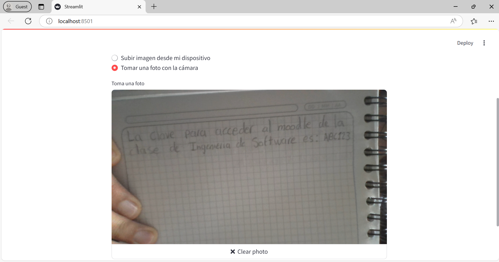

### Paso 4.6: Agregar un espacio para el prompt del usuario y un boton para llamar al modelo

Para agregar estos elementos se debe mdoificar el código de _multimodal_prompt_lab.py_ de la siguiente manera:

```python
import streamlit as st 
from utils.watsonx_functions import call_watsonx_vision_model

st.title("Mini Prompt Lab Multimodal")

modelo_seleccionado = st.selectbox("Elige el modelo que quieres utilizar", ["meta-llama/llama-4-scout-17b-16e-instruct", "meta-llama/llama-4-maverick-17b-128e-instruct-fp8", "meta-llama/llama-3-2-90b-vision-instruct","meta-llama/llama-3-2-11b-vision-instruct", "ibm/granite-vision-3-2-2b"]) 

max_tokens_seleccionados = st.number_input("Tokens de respuesta máximos", min_value=0, value=900)

modo_subir_imagen = st.radio("Selecciona una opcion", ["Subir imagen desde mi dispositivo", "Tomar una foto con la cámara"])

if modo_subir_imagen == "Subir imagen desde mi dispositivo":
    imagen_subida = st.file_uploader("Sube una imagen", type=["jpg","jpeg","png"])
    if imagen_subida is not None:
        with st.expander("Visualización de la imagen subida", expanded=True):
            st.image(imagen_subida)

elif modo_subir_imagen == "Tomar una foto con la cámara":
    imagen_subida = st.camera_input("Toma una foto")

if imagen_subida is not None:
    prompt_del_usuario = st.text_area("Prompt", placeholder="Escribe aquí tu prompt")
    boton_llamar_watsonx = st.button("Llamar al modelo multimodal")
    if boton_llamar_watsonx:
        respuesta_generada = call_watsonx_vision_model(
            prompt=prompt_del_usuario,
            imagen=imagen_subida,
            id_modelo=modelo_seleccionado,
            max_tokens=max_tokens_seleccionados
        )

        with st.expander("Respuesta Generada", expanded=True):
            st.write(respuesta_generada)
```

Las nuevas lineas incluidas al final del código se encargan de:

1. Verificar que exista una imagen
2. Cuando hay una imagen subida, mostrar un st.text_area() donde el usuario puede escribir su prompt y mostrar un st.button() para llamar el modelo.
3. Cuando el boton se oprime, se llama a la función _call_watsonx_vision_model_ con los parametros dados por el usuario. Esta función retorna el texto generado por el modelo multimodal.
4. Finalmente, muestra la respuesta generada dentro de un contendor st.expander().

Una vez se guardan estos cambios y se va al navegador se puede probar la aplicación completa, la cual deberia verse de la siguiente manera:

https://github.com/user-attachments/assets/9320319f-161e-4448-89e6-1d0242a1251a

### Paso 4.7: Conclusion

En esta sección se construyo una aplicación que permite llamar modelos multimodales alojados en WatsonX para poder realizar consultas que incluyen textos e imagenes.

## Sección 5: Crear una aplicación para interactuar con una base de datos vectorial hecha con ChromaDB

[ChromaDB](https://www.trychroma.com/) es una base de datos vectorial con la que se puede interactuar facilmente dentro de Python. 

Las bases de datos vectoriales son bases de datos especiales que permiten almacenar un texto (En el caso de ChromaDB estos textos se llaman _documentos_) junto con su vector de embedding.

Debido a esto, a las bases de datos vectoriales se les puede hacer una consulta con una frase y ellas pueden responder con los documentos cuyo vector de embedding tiene menor distancia al texto que se recibio en la consulta.

Este tipo de bases de datos son muy utilizadas para realizar RAG. En este tutorial se utilizarán unicamente algunas funciones basicas que ofrecen, pero cabe resaltar que este tipo de bases de datos pueden ofrecer muchas más funcionalidades.

Una base de datos creada en ChromaDB se divide en colecciones. Cada colección permite almacenar documentos de forma aislada a las otras colecciones de la base de datos, esto sirve para que en cada colección que se cree unicamente se guarden datos de un tema en especifico (Por ejemplo tener una colección para textos que hablen de cocina y otra coleccion para textos que hablen de historia). 

Las colecciones en las bases de datos vectoriales son similares a lo que son las tablas en las bases de datos relacionales, en donde se crea una tabla para cada entidad que se quiere almancenar en la base de datos relacional. En el caso de este tutorial solo se va a crear una sola coleccion en la base de datos, en donde se van a almacenar todos los datos que el usuario cree.

La idea en esta sección es crear una aplicación que permita subir, visualizar o eliminar documentos de la base de datos vectorial. 

La aplicación tambien tendrá una sección se podrá hacer una consulta a la base de datos para verificar cuales son los documentos guardados más cercanos a el texto ingresado en la consulta.

### Paso 5.1: Detener la aplicación _multimodal_prompt_lab.py_ en caso de que se este ejecutando

### Paso 5.2: Instalar las dependencias necesarias para utilizar la base de datos vectorial ChromaDB.

Para utilizar ChromaDB en la aplicación se requiere instalar 3 librerias, las cuales se pueden instalar ejecutando el siguiente comando en la terminal que tiene el entorno virtual activado:

```console
pip install chromadb==1.0.0 sentence-transformers==4.0.2 transformers==4.50.3
```

**ADVERTENCIA**: Estas librerias tienen un gran tamaño y pueden tardar varios minutos en instalarse. Mientras estas librerias se instalan se puede continuar con los siguientes pasos de este tutorial. 

La libreria _chromadb_ trae todo lo necesario para poder crear e interactuar con una base de datos vectorial de ChromaDB.

Las librerias _sentence-transformers_ y _transformers_ permiten utilizar los modelos de embedding necesarios para crear los vectores que se van a almacenar en la base de datos.

### Paso 5.2: Crear un archivo con las funciones que permiten interactuar con ChromaDB

Dentro de la carpeta _utils_ se debe crear un archivo con el nombre _chromadb_functions.py_. La carpeta del proyecto deberia verse de esta forma tras crear el archivo: 

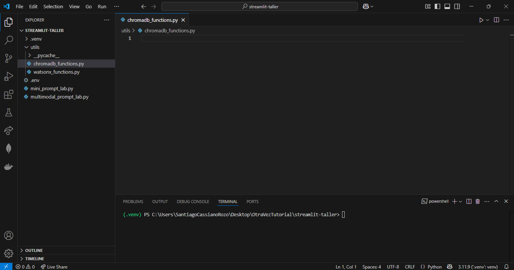

Dentro del archivo se van a crear 4 funciones que van a permitir interactuar con la base de datos ChromaDB. 

Para esto, se debe copiar el siguiente código dentro del archivo:

```python
import chromadb
from chromadb.utils import embedding_functions
import torch

#Esta linea previene que salga una advertencia en consola por un error que tiene temporalmente Streamlit con Torch.
#No es obligatoria y no tiene relacion con la aplicacion
torch.classes.__path__ = [] 

#Funcion para almacenar un documento con un identificador en la coleccion "mi coleccion" de la base de datos vectorial
def agregar_documento_bd(identificador:str, documento:str):
    #Iniciar cliente para conectarse a la base de datos vectorial persistente
    #La primera vez que se ejecuta esta sentencia se crea la carpeta chroma en el proyecto
    #En es carpeta va a estar la base de datos vectorial
    chroma_client = chromadb.PersistentClient(path="./chroma")  

    #Definir la funcion de embedding que se va a utilizar en la coleccion de la base de datos vectorial
    embedding_function = embedding_functions.SentenceTransformerEmbeddingFunction(
        model_name="ibm-granite/granite-embedding-278m-multilingual"
    )

    #Crear o acceder a la coleccion llamada "mi_coleccion" de la base de datos vectorial
    #Se define la funcion de embedding que se va a usar en los documentos de la coleccion
    mi_coleccion = chroma_client.get_or_create_collection(
        name="mi_coleccion", 
        embedding_function=embedding_function
    )

    #Se agrega el documento a la base de datos vectorial:
    #La base de datos se encarga de almacenar el documento y el embedding calculado con la funcion definida
    mi_coleccion.add(
        ids=[identificador],
        documents=[documento]
    )


#Funcion para consultar todos los documentos guardados en la colección llamada "mi_coleccion" en la base de datos vectorial
def obtener_todos_los_documentos_bd():
    #Iniciar cliente para conectarse a la base de datos vectorial persistente
    #La primera vez que se ejecuta esta sentencia se crea la carpeta chroma en el proyecto
    #En es carpeta va a estar la base de datos vectorial
    chroma_client = chromadb.PersistentClient(path="./chroma")  

    #Definir la funcion de embedding que se va a utilizar en la coleccion de la base de datos vectorial
    embedding_function = embedding_functions.SentenceTransformerEmbeddingFunction(
        model_name="ibm-granite/granite-embedding-278m-multilingual"
    )

    #Crear o acceder a la coleccion llamada "mi_coleccion" de la base de datos vectorial
    #Se define la funcion de embedding que se va a usar en los documentos de la coleccion
    mi_coleccion = chroma_client.get_or_create_collection(
        name="mi_coleccion", 
        embedding_function=embedding_function
    )

    #Obtener los documentos guardados en la coleccion "mi_coleccion"
    diccionario_documentos_guardados = mi_coleccion.get()

    return diccionario_documentos_guardados


#Funcion para eliminar un documento de la base de datos segun su id:
def eliminar_documento_segun_id_bd(identificador:str):
    #Iniciar cliente para conectarse a la base de datos vectorial persistente
    #La primera vez que se ejecuta esta sentencia se crea la carpeta chroma en el proyecto
    #En es carpeta va a estar la base de datos vectorial
    chroma_client = chromadb.PersistentClient(path="./chroma")  

    #Definir la funcion de embedding que se va a utilizar en la coleccion de la base de datos vectorial
    embedding_function = embedding_functions.SentenceTransformerEmbeddingFunction(
        model_name="ibm-granite/granite-embedding-278m-multilingual"
    )

    #Crear o acceder a la coleccion llamada "mi_coleccion" de la base de datos vectorial
    #Se define la funcion de embedding que se va a usar en los documentos de la coleccion
    mi_coleccion = chroma_client.get_or_create_collection(
        name="mi_coleccion", 
        embedding_function=embedding_function
    )

    #Eliminar de la coleccion "mi_coleccion" el documento que tiene el identificador recibido
    mi_coleccion.delete(
        ids=[identificador]
    )


#Funcion que permite realizar una consulta a la base de datos vectorial y obtener la cantidad max_resultados de 
# documentos más relevantes para la consulta realizada
def realizar_consulta_a_la_bd(documento_consulta:str, max_resultados:int):
    #Iniciar cliente para conectarse a la base de datos vectorial persistente
    #La primera vez que se ejecuta esta sentencia se crea la carpeta chroma en el proyecto
    #En es carpeta va a estar la base de datos vectorial
    chroma_client = chromadb.PersistentClient(path="./chroma")  

    #Definir la funcion de embedding que se va a utilizar en la coleccion de la base de datos vectorial
    embedding_function = embedding_functions.SentenceTransformerEmbeddingFunction(
        model_name="ibm-granite/granite-embedding-278m-multilingual"
    )

    #Crear o acceder a la coleccion llamada "mi_coleccion" de la base de datos vectorial
    #Se define la funcion de embedding que se va a usar en los documentos de la coleccion
    mi_coleccion = chroma_client.get_or_create_collection(
        name="mi_coleccion", 
        embedding_function=embedding_function
    )

    #Obtener los documentos guardados en la coleccion "mi_coleccion"
    documentos = mi_coleccion.query(
        query_texts = [documento_consulta],
        n_results=max_resultados
    )

    #Retornar los documentos relevantes para la consulta
    return documentos
```

En este código se definen 4 funciones:
1. _agregar_documento_bd()_: Esta funcion se conecta a la base de datos y permite agregar un documento a una colección llamada "mi_collecion".

    En caso de que la colleción no exista dentro de la base de datos, esta función la crea automaticamente. Cuando se inserta el documento en la base de datos se almacenan su identificador, el documento (Es decir, el texto) y el vector de embedding calculado. En este caso el modelo con el que se crea el embedding es _granite-embedding-278m-multilingual_.

2. _obtener_todos_los_documentos_bd()_: Esta funcion retorna todos los documentos guardados en la coleccion "mi_coleccion" de la base de datos vectorial.

3. _eliminar_documento_segun_id_bd()_: Esta funcion permite eliminar un documento segun el identificador con el que fue creado.

4. _realizar_consulta_a_la_bd()_: Esta funcion recibe un texto y retorna los documentos almacenados más cercanos al texto escrito en la consulta.

Todas estas funciones seran utilizadas para crear la aplicación que permita interactuar con la base de datos vectorial y posteriormente para crear una aplicación que permita hacer RAG sobre los documentos guardados.

Cabe resaltar que estas son funciones basicas para interactuar con la base de datos y no aprovechan todas las posibilidades que ofrece ChromaDB. [ChromaDB](https://www.trychroma.com/). ChromaDB ofrece muchas otras funcionalidades y opciones para otros casos de uso más complejos.

### Paso 5.3: Crear un archivo para la aplicación que permitirá la interacción con base de datos vectorial.

Se debe crear un archivo llamado _interaccion_db.py_ al mismo nivel en el que estan los archivos _multimodal_prompt.py_ y _mini_prompt_lab.py_.

Este archivo es donde se escribirá la aplicación que permitira interacción con la base de datos. 

Tras crearse este archivo, así deberia verse la carpeta del proyecto:

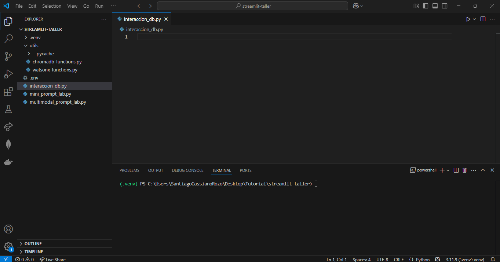

### Paso 5.4: Crear la lógica para la aplicación.

Dentro del archivo _interaccion_db.py_ se debe copiar el siguiente código, el cual contiene la lógica de la aplicación completa:

```python
import streamlit as st
from utils.chromadb_functions import *

st.title("Interaccion con la base de datos vectorial")

operaciones = ["Agregar un documento", "Ver documentos guardados", "Eliminar un documento", "Realizar una consulta a la base de datos"]

operacion_seleccionada = st.pills("Selecciona una operacion a realizar en la base de datos", operaciones)

if operacion_seleccionada == "Agregar un documento":
    identificador_a_agregar = st.text_input("Identificador para el documento a agregar", placeholder="Escribe aquí el identificador")
    documento_a_agregar = st.text_area("Documento a agregar", placeholder="Escribe aquí el documento que quieres agregar a la base de datos")

    boton_agregar = st.button("Agregar documento")
    if boton_agregar:
        resultados = obtener_todos_los_documentos_bd()
        if identificador_a_agregar in resultados['ids']:
            st.error("No se pudo agregar el documento debido a que ya existe un documento con el mismo identificador en la coleccion de la base de datos")
        else:
            agregar_documento_bd(identificador_a_agregar, documento_a_agregar)
            st.success("Documento agregado exitosamente a la base de datos")

elif operacion_seleccionada == "Ver documentos guardados":
    resultados = obtener_todos_los_documentos_bd()
    if len(resultados['ids']) == 0:
        st.warning("No hay documentos guardados en la base de datos")
    else:
        #Se realiza un bucle para recorrer los documentos y mostrarlos
        #Se recorre cada uno de los ids y se muestra el id en el titulo del contendor
        # y dentro del contendor se muestra el documento almacenado asociado a ese id
        for index in range(len(resultados['ids'])):
            with st.expander(f"ID: _{resultados['ids'][index]}_", expanded=False): 
                st.write(resultados['documents'][index])

elif operacion_seleccionada == "Eliminar un documento":
    #Se obtienen los documentos guardados
    resultados = obtener_todos_los_documentos_bd()

    #Se obtiene la lista de identificadores de los documentos guardados
    lista_ids = resultados['ids']

    #Se muestra la lista de identificadores en un menu tipo dropdown
    identificador_seleccionado = st.selectbox("Selecciona el identificador del documento a eliminar",lista_ids)

    #Si se selecciono un identificador
    if identificador_seleccionado is not None:
        boton_eliminar = st.button("Haz clic aquí para eliminar el documento seleccionado", on_click=eliminar_documento_segun_id_bd, args=[identificador_seleccionado])


elif operacion_seleccionada == "Realizar una consulta a la base de datos":
    #Mostar un documento en pantalla
    st.write("Escribe una consulta y observa cuales son los documentos con menor distancia al texto de la consulta")

    #Crear un text area para que el usuario pueda escribir su consulta
    texto_consulta = st.text_area("Escribe el texto con el cual realizar la consulta a la base de datos")

    #Crear un number_input para que el usuario pueda decir máximo cuantos resultados quiere obtener
    max_resultados = st.number_input("Ingresa la cantidad maxima de resultados que quieres obtener", min_value=1, value=3)

    #Crear un boton para realizar la consulta
    boton_realizar_consulta = st.button("Realizar la consulta")
    if boton_realizar_consulta:
        #Llamar la función para realizar la consulta a la base de datos
        resultados = realizar_consulta_a_la_bd(texto_consulta, max_resultados)
        #Si hubo 0 resultados, decir en pantalla
        if len(resultados['ids'][0]) == 0:
            st.warning("No se encontraron documentos")
        
        else:
            #Si hubo resultados, mostrarlos en un contenedor cada uno, indicando su id, distancia y contenido
            for index in range(len(resultados['ids'][0])):
                with st.expander(f"ID: _{resultados['ids'][0][index]}_ ↔️ Distancia respecto a la consulta: {resultados['distances'][0][index]}", expanded=False): 
                    st.write(resultados['documents'][0][index])
```

### Paso 5.5: Explicación de la lógica de la aplicación

En esta sección no se contruyo la aplicación paso a paso debido a que en su mayoria se usan varios elementos ya conocidos en anteriores secciones.

Sin embargo, hay algunas cosas nuevas que se explican a continuación:

1. Se utiliza un elemento de tipo [st.pills()](https://docs.streamlit.io/develop/api-reference/widgets/st.pills) para que el usuario pueda elegir cual operación quiere realizar sobre la base de datos vectorial.

2.  Si la operación seleccionada es "Agregar un documento" el usuario podra ingresar el identificador y el documento a agregar en la aplicación. Cuando oprima el botón se verificará que no exista ya un documento almacenado con el mismo identificador y llamará a la función _agregar_documento_bd()_ para insertar el nuevo documento en la base de datos. Finalmente se muestra un mensaje indicando que la operación fue exitosa con el elemento [st.success](https://docs.streamlit.io/develop/api-reference/status/st.success)

3. Si el usuario elige "Ver documentos guardados" entonces se llamara a la función encargada de traer los documentos guardados. La funcion _obtener_todos_los_documentos_bd()_ retorna un diccionario del siguiente estilo (El diccionario contiene más datos, pero estos son los relevantes para esta aplicación):

    ```python
    {
        'ids':['id1','id2',...],
        'documents':['documento1','documento2',...]
    }
    ```
    Para mostrar todos los documentos se recorre la lista de _ids_ y _documents_. Mostrando cada id junto a su documento asociado.

4. Si el usuario elige la operacion "Eliminar un documento", se muestra un menú de tipop st.select_box con los ids de los documentos guardados. El usuario puede elegir un id y luego dar click a un boton para eliminarlo. Cuando se hace click este boton llama a la función _eliminar_documento_segun_id_bd()_ y le pasa como argumento el id seleccionado por el usuario.

5. Finalmente si se elige la operación "Realizar una consulta a la base de datos" entonces aparecera un espacio donde el usuario puede escribir su consutla y seleccionar la cantidad máxima de resultados que quiere obtener. 
    
    Luego el usuario puede oprimir un boton para realizar la consulta. La funcion _realizar_consulta_a_la_bd()_ retorna los resultados en un diccionario del siguiente estilo:

    ```python
    {
        'ids':[['id1','id2',...]],
    'documents':[['documento1','documento2',...]],
        'distances':[[0.6,0.9,...]]
    }
    ```

    Este diccionario se recorre para mostrar el id, el documento y la distancia del embedding del documento al embbeding del texto de la consulta del usuario. Por ejemplo, la distancia que esta en la primera posición de la lista de _distances_ corresponde a la distancia respecto a la consulta del usuario que tiene el contenido del documento que esta en la primera posicion de la lista _documents_.

### Paso 5.6: Ejecutar la aplicación

Si ya se han instalado las librerias, entonces se puede ejecutar el siguiente comando en la terminal para ejecutar la aplicación:

```python
streamlit run interaccion_db.py
```

A continuación se muestran videos ejemplificando cada una de las operaciones que se pueden realizar en la aplicación. La primera operación que se haga puede tardar un tiempo debido a que tiene que crear la base de datos (La cual queda guardada en la carpeta _chroma_ dentro del proyecto) y debe iniciar la conexión con la base de datos. Las siguientes operaciones serán más rápidas:

- Agregar documentos y Ver documentos guardados:

https://github.com/user-attachments/assets/dd6b249f-c2e9-41a4-b670-21412fb87a7e

- Eliminar un documento:

https://github.com/user-attachments/assets/48403513-5400-488c-bfb5-aa8953761e30

- Realizar una consulta a la base de datos:

https://github.com/user-attachments/assets/5f7273e4-749f-43de-b166-e7806091c142

Una vez se ha usado la aplicación, se debio crear una carpeta llamada _chroma_ dentro de la carpeta del proyecto:

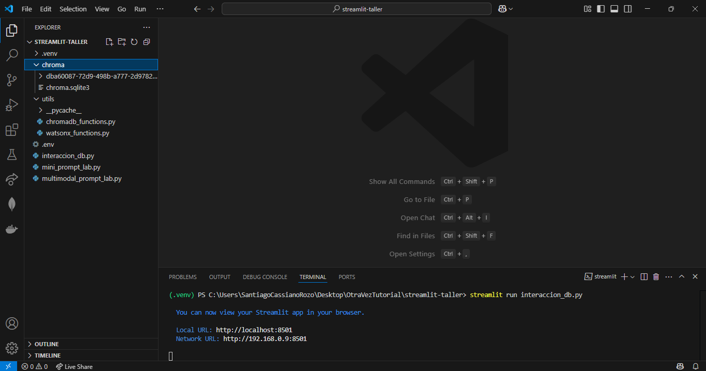

En esa carpeta se almacenan todos los datos de la base de datos vectorial de la aplicación.

## Sección 6: Crear una aplicación para hacer RAG sobre los documentos guardados en la base de datos vectorial

En esta sección se busca crear una nueva aplicación en donde se puedan realizar consultas a un LLM el cual base sus respuestas en los documentos más relevantes que tengamos almacenados en la base de datos vectorial creada en la anterior seccion.

Para ello, se van a incluir los documentos relevantes en el prompt que se realiza al LLM.

### Paso 6.1: Detener la aplicación _interaccion_db.py_ en caso de que se este ejecutando.

### Paso 6.2: Crear un archivo para la aplicación del RAG

Se debe crear un archivo llamado _rag.py_ en la carpeta del proyecto. Este archivo debe quedar al mismo nivel en el que estan los archivos _interaccion_db.py_, _multimodal_prompt.py_ y _mini_prompt_lab.py_.

Tras crearse este archivo, así deberia verse la carpeta del proyecto:

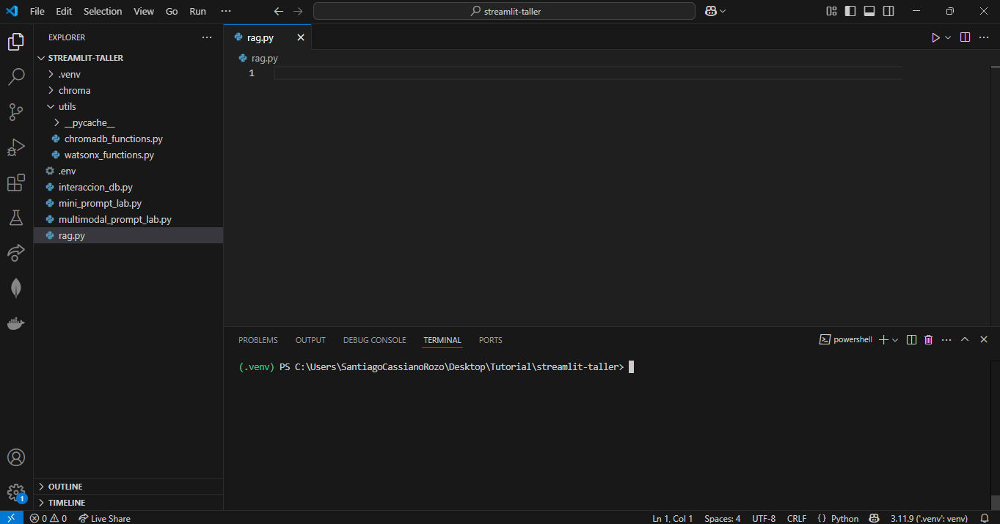

Este archivo es donde se escribirá la aplicación para realizar RAG a partir de los documentos guardados en la base de datos vectorial.

### Paso 6.3: Crear la lógica para la aplicación.

Dentro del archivo _rag.py_ se debe copiar el siguiente código, el cual contiene la lógica de la aplicación completa:

```python
import streamlit as st
from utils.watsonx_functions import call_watsonx_text_model
from utils.chromadb_functions import *

st.title("RAG sobre los documentos guardados")

# En esta seccion de la aplicación se podrá realizar una consulta a un LLM que se soporta en los documentos mas relevantes
#Para esto, primero se verifica que existan documentos guardados en la base de datos
resultados = obtener_todos_los_documentos_bd()

if len(resultados['documents']) > 0:
    st.write("Aquí podrás realizar una consulta a un LLM y el modelo va a responder basandose en los 3 documentos guardados más relevantes para la pregunta")

    modelo_seleccionado = st.selectbox("Elige el modelo que quieres utilizar", ["ibm/granite-3-2-8b-instruct","mistralai/mistral-large", "meta-llama/llama-3-3-70b-instruct", "meta-llama/llama-4-scout-17b-16e-instruct", "meta-llama/llama-4-maverick-17b-128e-instruct-fp8"])

    min_tokens_seleccionados = st.number_input("Tokens de respuesta mínimos", min_value=0)

    max_tokens_seleccionados = st.number_input("Tokens de respuesta máximos", min_value=0, value=200)
    
    consulta_usuario = st.text_input("Escribe tu consulta para el LLM",placeholder="Escribe tu consulta")

    boton_consulta_llm = st.button("Consultar al LLM")
    if boton_consulta_llm:
        #Llamamos la funcion encargada de extraer los documentos mas relevantes para la consulta del usuario
        documentos= realizar_consulta_a_la_bd(consulta_usuario, max_resultados=3)

        #Se construye un string con cada uno de los documentos relevantes obtenidos
        #Se realiza un bucle para recorrer los documentos y agregarlos a un string
        string_documentos = ""
        for index in range(len(documentos['ids'][0])):
            string_documentos += f"Documento {index+1}: {documentos['documents'][0][index]}\n\n"

        #Una vez se tiene un string con todos los documentos relevantes se insertan estos documentos
        # En el prompt final que se va a realizar al LLM
        prompt_final =(
           "Eres un asistente encargado de resolver preguntas del usuario basandote principalmente en los documentos que se tienen guardados sobre el tema de la pregunta del usuario\n\n"
           "Tu objetivo es responder la pregunta del usuario basandote principalmente en la siguiente lista de documentos,"
           "en caso de que en los documentos no haya informacion que consideres relevante para resolver la pregunta del usuario"
           "entonces unicamente responde 'No se encontraron documentos relevantes para la pregunta' y mencionas cual fue la pregunta del usuario.\n\n"
           "La lista de documentos es la siguiente:\n\n"
           f"{string_documentos}"
           f"La pregunta del usuario es la siguiente: {consulta_usuario}\n\n"
           "Tu respuesta es:\n\n"
        ) 

        #Se llama al modelo del lenguaje con el prompt creado, algunos parametros dados por el usuario
        # y el modo Greedy y Repetition Penalty de 1:
        respuesta_llm = call_watsonx_text_model(prompt_final,id_modelo=modelo_seleccionado, min_tokens=min_tokens_seleccionados, max_tokens=max_tokens_seleccionados, modo="Greedy", repetition_penalty=1)
        
        #Una vez armado el prompt se muestra el verdadero prompt que se realizo al LLM
        # el cual que incluye los documentos relevantes
        with st.expander("📄 Prompt enviado al LLM", expanded=False):
            st.write(prompt_final)
        
        #Se muestra la respuesta generada por el LLM
        with st.expander("✨ Respuesta generada", expanded=True):
            st.write(respuesta_llm)

else:
    st.warning("No tienes documentos guardados en la base de datos, por favor agrega al menos uno para poder realizar consultas en esta pestaña")
```

### Paso 6.4: Explicación de la lógica de la aplicación

Al inicio del código de la aplicación se verifica si hay al menos un documento almacenado. En caso de que haya un documento almacenado se muestran varios elementos (similares a los utilizados en el Mini Prompt Lab) para que el usuario elija el LLM al cual quiere hacer la consulta, los tokens mínimos y maximos de respuesta. Tambien se incluye un espacio para que el usuario escriba la consulta que quiere realizar al LLM.

Una vez el usuario oprime el boton para realizar la consulta al LLM ocurren varias cosas:
1. Se realiza una consulta a la base de datos vectorial y se extraen los 3 documentos más relevantes, es decir, aquellosque tienen menor distancia hacia la consulta escrita por el usuario.

2. Una vez se extraen los documentos, se recorren los documentos y se un string que incluye el contenido de cada uno de estos documentos relevantes.

3. Se crea la variable _prompt_final_, la cual incluye varias instrucciones para el LLM y además incluye el string almacenado en la variable _string_documentos_, el cual incluye el texto de los 3 documentos mas cercanos a la pregunta del usuario. La variable _prompt_final contiene el prompt aumentado que realmente se va a hacer al LLM.

Este prompt le indica al modelo que debe resolver las preguntas basandose principalmente en la lista de documentos relevantes que se incluyen en el prompt por medio de la variable _string_documentos_

Finalmente se llama al modelo con el _prompt_final_ y una vez este responde se muestra en un contenedor el prompt que estaba en la variable _prompt_final_ (Esto para que el usuario vea el prompt que realmente se hizo al LLM) y en otro contenedor se observa la respuesta generada.

### Paso 6.5: Ejecutar la aplicación

Se utiliza el siguiente comando en la terminal para ejecutar la aplicación:

```python
streamlit run rag.py
```

A continuación se muestra un ejemplo del uso de la aplicación:

https://github.com/user-attachments/assets/dd4da25c-0a1f-459e-ae32-064e0f26105e

En el ejemplo se ve que el LLM se basa principalmente en el documento (el cual fue incluido por la aplicación en el prompt del LLM) para responder la consulta del usuario.

## Paso 7: Unir todas las aplicaciones en una sola aplicación

Streamlit permite crear aplicaciones que tengan [multiples pestañas](https://docs.streamlit.io/develop/concepts/multipage-apps) a partir de varios archivos Python. En esta sección se va a ver una forma de crear aplicaciones con multiples pestañas en Streamlit.

Para ello se va a crear una nueva aplicación, en la cual cada una de las aplicaciones creadas a lo largo del tutorial van a ser pestañas dentro de la aplicación.

### Paso 7.1: Detener la aplicación _rag.py_ en caso de estar ejecutandose

### Paso 7.2: Crear una carpeta llamada _paginas_ en el proyecto

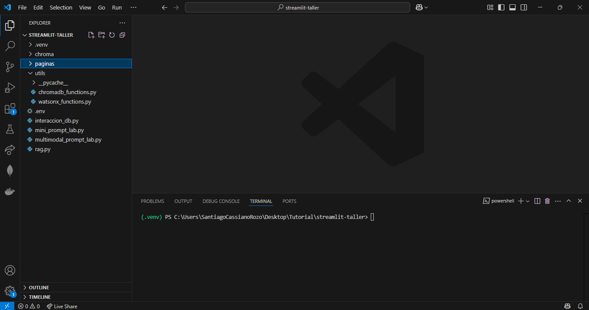

### Paso 7.3: Mover las aplicaciones e la carpeta paginas

Se deben mover los archivos _mini_prompt_lab.py_, _multimodal_prompt_lab.py_ _interaccion_db.py_ y _rag.py_ a la carpeta paginas:

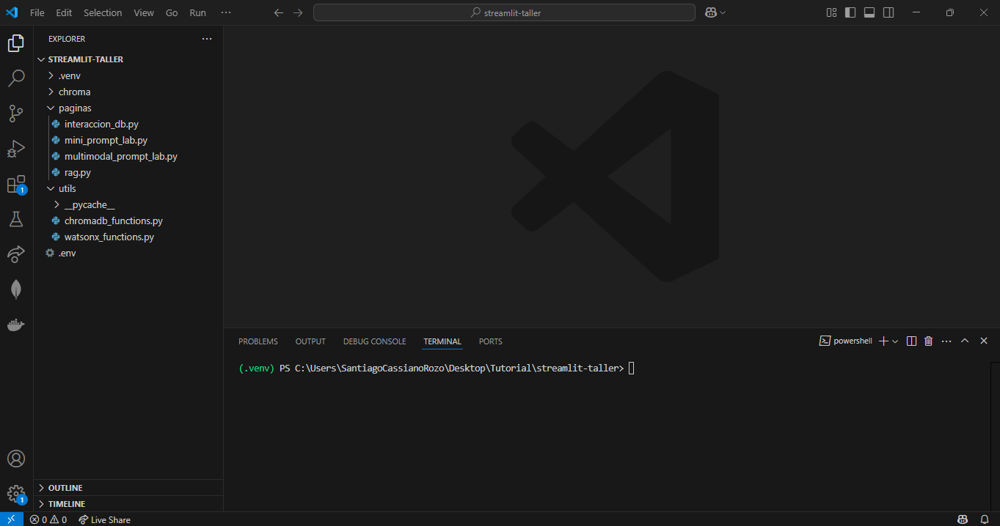

### Paso 7.4: Crear un nuevo archivo de Python en la carpeta del proyecto

Se debe crear un archivo llamado app.py en la base de la carpeta del proyecto:

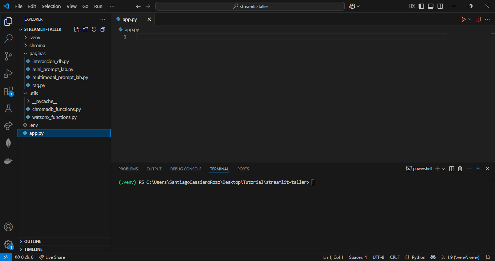

Dentro del archivo app.py se va a incluir el código necesario para crear una aplicación que incluya cada una de las aplicaciones creadas a lo largo del tutorial.

### Paso 7.5: Crear la lógica para el archivo app.py.

Dentro del archivo app.py se debe incluir el siguiente código:

```python
import streamlit as st

#Definir las páginas que va a tener la aplicacion
pagina_mini_prompt_lab = st.Page(page='./paginas/mini_prompt_lab.py', title='Mini Prompt Lab')
pagina_multimodal_prompt_lab = st.Page(page='./paginas/multimodal_prompt_lab.py', title='Multimodal Prompt Lab')
pagina_interaccion_db = st.Page(page='./paginas/interaccion_db.py', title='Interaccion con BD Vectorial')
pagina_rag = st.Page(page='./paginas/rag.py', title='RAG')

#Se pasan las paginas al st.navigation(), el cual se encarga de permitir la navegacion entre las paginas
# y mostrarlas en la barra lateral de la aplicacion
pagina_seleccionada = st.navigation([pagina_mini_prompt_lab,pagina_multimodal_prompt_lab,pagina_interaccion_db,pagina_rag])

#Se ejecuta la pagina que el usuario haya seleccionado en la barra de navegacion
pagina_seleccionada.run()
```

En este código se definen cada una de las paginas que queremos tener en nuestra aplicación con el elemento [st.Page()](https://docs.streamlit.io/develop/api-reference/navigation/st.page). 

Luego cada una de las paginas se agrega a una lista y se pasa como argumento al elemento [st.navigation()](https://docs.streamlit.io/develop/api-reference/navigation/st.navigation), el cual se encarga de permitir la navegación entre las páginas de la lista y las incluye en una barra lateral dentro de la aplicacion.

Finalmente, la ultima linea del código se encarga de ejecutar la página que tenga seleccionado el usuario en la barra lateral.

### Paso 7.6: Ejecutar la aplicacion multipagina

Para ejecutar la aplicación se debe ejecutar el comando:

```python
streamlit run app.py
```

Una vez se ejecute la aplicación, en el navegador deberia verse de la siguiente forma:

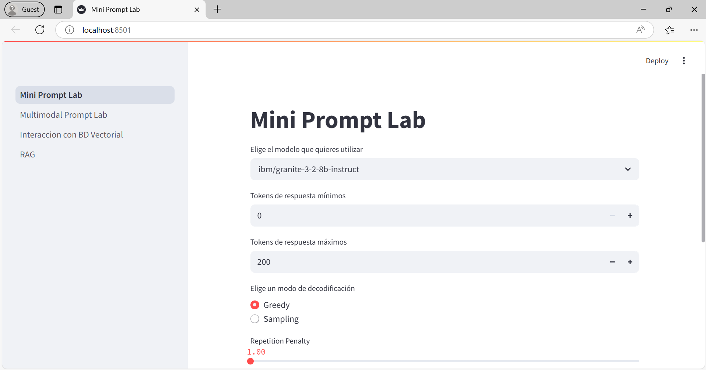

Cada una de las aplicaciones creadas anteriormente ahora son pestañas en esta ultima aplicación.

### Paso 7.7: (Opcional) Modificar _app.py_ para evitar que salga un error en la consola

Es posible que salga el siguiente error en la consola tras ejecutar la aplicacion app.py:

```
RuntimeError: Tried to instantiate class '__path__._path', but it does not exist! Ensure that it is registered via torch::class_
```

Este error es un problema que temporalmente tiene Streamlit con la libreria Torch, pero que no afecta el funcionamiento de la aplicación. Para evitar que este error salga se puede modificar el archivo app.py se la siguiente manera:

```python
import streamlit as st
import torch

#Esta linea previene que salga una advertencia en consola por un error que tiene temporalmente Streamlit con Torch.
#No es obligatoria y no tiene relacion con la aplicacion
torch.classes.__path__ = [] 

#Definir las páginas que va a tener la aplicacion
pagina_mini_prompt_lab = st.Page(page='./paginas/mini_prompt_lab.py', title='Mini Prompt Lab')
pagina_multimodal_prompt_lab = st.Page(page='./paginas/multimodal_prompt_lab.py', title='Multimodal Prompt Lab')
pagina_interaccion_db = st.Page(page='./paginas/interaccion_db.py', title='Interaccion con BD Vectorial')
pagina_rag = st.Page(page='./paginas/rag.py', title='RAG')

#Se pasan las paginas al st.navigation(), el cual se encarga de permitir la navegacion entre las paginas
# y mostrarlas en la barra lateral de la aplicacion
pagina_seleccionada = st.navigation([pagina_mini_prompt_lab,pagina_multimodal_prompt_lab,pagina_interaccion_db,pagina_rag])

#Se ejecuta la pagina que el usuario haya seleccionado en la barra de navegacion
pagina_seleccionada.run()
```

Una vez realizado este cambio, ya no deberia volver a salir el error en la consola.

Con esto se termina el tutorial del taller practico de Streamlit y RAG.

Streamlit es un framework muy adecuado para construir aplicaciones web rápidamente. En este tutorial solo se vieron algunos elementos que componen este framework, si quiere aprender más puede ir a la pagina de introducción de Streamlit: https://docs.streamlit.io/get-started

# Reto.

Ahora que ha terminado el tutorial se sugieren dos retos, puede seleccionar el que prefiera:

1. Agregue muchos documentos sobre un tema en especifico a la base de datos vectorial, de manera que cuando se haga RAG el LLM pueda responder muchas preguntas sobre ese tema.

2. Cree otra aplicación de Streamlit en donde haga uso interesante de los modelos de texto de WatsonX, los modelos de vision de WatsonX o de la base de datos Vectorial.

Al final de la sesión las personas que quieran podrán mostrar el reto al resto de la clase.
